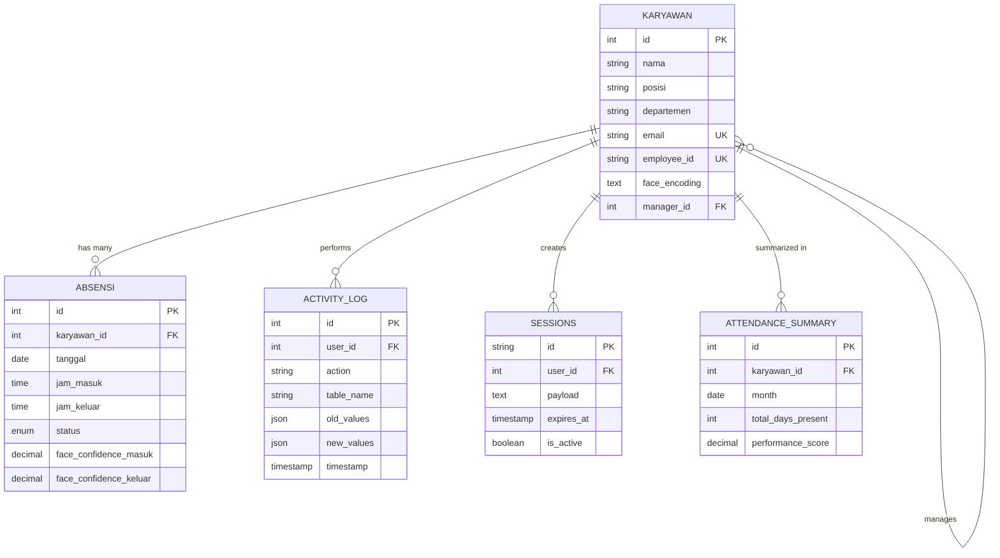

# 🗄️ Database Documentation - ABSENN

## 📋 **Overview**

ABSENN menggunakan **MySQL 8.0+** sebagai primary database dengan arsitektur yang optimal untuk high-performance attendance management dan face recognition data storage.

---

## 🏗️ **Database Architecture**

```
┌─────────────────────────────────────────────────────────────┐
│                    DATABASE ARCHITECTURE                    │
├─────────────────────────────────────────────────────────────┤
│                                                             │
│  ┌─────────────┐    ┌─────────────┐    ┌─────────────┐     │
│  │  Application│    │   Connection│    │   MySQL     │     │
│  │   Layer     │◄──►│    Pool     │◄──►│   Server    │     │
│  │             │    │   (20 max)  │    │   8.0+      │     │
│  └─────────────┘    └─────────────┘    └─────────────┘     │
│                                                │            │
│                                                ▼            │
│  ┌─────────────┐    ┌─────────────┐    ┌─────────────┐     │
│  │  Redis      │    │  Backup     │    │  Analytics  │     │
│  │  Cache      │    │  System     │    │  Warehouse  │     │
│  │  (Optional) │    │  (Daily)    │    │  (Optional) │     │
│  └─────────────┘    └─────────────┘    └─────────────┘     │
│                                                             │
└─────────────────────────────────────────────────────────────┘
```

---

## 📊 **Database Schema**

### 🏢 **Table: `karyawan` (Employees)**

**Purpose**: Menyimpan data master karyawan dan face recognition features

```sql
CREATE TABLE `karyawan` (
  `id` int NOT NULL AUTO_INCREMENT,
  `nama` varchar(255) NOT NULL,
  `posisi` varchar(255) DEFAULT NULL,
  `departemen` varchar(255) DEFAULT NULL,
  `email` varchar(255) UNIQUE DEFAULT NULL,
  `nomor_telepon` varchar(20) DEFAULT NULL,
  `tanggal_bergabung` date DEFAULT NULL,
  `status` enum('aktif','non_aktif','cuti') DEFAULT 'aktif',
  `face_encoding` text,
  `foto_profil` varchar(500) DEFAULT NULL,
  `created_at` timestamp DEFAULT CURRENT_TIMESTAMP,
  `updated_at` timestamp DEFAULT CURRENT_TIMESTAMP ON UPDATE CURRENT_TIMESTAMP,
  `is_admin` boolean DEFAULT FALSE,
  `employee_id` varchar(50) UNIQUE DEFAULT NULL,
  `salary` decimal(15,2) DEFAULT NULL,
  `manager_id` int DEFAULT NULL,
  
  PRIMARY KEY (`id`),
  KEY `idx_nama` (`nama`),
  KEY `idx_departemen` (`departemen`),
  KEY `idx_status` (`status`),
  KEY `idx_employee_id` (`employee_id`),
  KEY `idx_manager` (`manager_id`),
  
  FOREIGN KEY (`manager_id`) REFERENCES `karyawan`(`id`) ON DELETE SET NULL,
  
  -- Constraints
  CONSTRAINT `chk_email` CHECK (email REGEXP '^[A-Za-z0-9._%+-]+@[A-Za-z0-9.-]+\.[A-Za-z]{2,}$'),
  CONSTRAINT `chk_phone` CHECK (nomor_telepon REGEXP '^[0-9+()-\s]+$')
) ENGINE=InnoDB DEFAULT CHARSET=utf8mb4 COLLATE=utf8mb4_unicode_ci;
```

**Field Descriptions**:
- `id`: Primary key, auto-increment
- `nama`: Employee full name (required)
- `posisi`: Job position/title
- `departemen`: Department/division
- `email`: Email address (unique, validated)
- `nomor_telepon`: Phone number (validated format)
- `tanggal_bergabung`: Join date
- `status`: Employee status (aktif/non_aktif/cuti)
- `face_encoding`: Serialized face recognition features (text/JSON)
- `foto_profil`: Profile photo path/URL
- `is_admin`: Admin privileges flag
- `employee_id`: Unique employee identifier
- `salary`: Monthly salary (encrypted recommended)
- `manager_id`: Reference to manager (self-referencing FK)

---

### 📅 **Table: `absensi` (Attendance)**

**Purpose**: Menyimpan data kehadiran karyawan dengan timestamp dan metadata

```sql
CREATE TABLE `absensi` (
  `id` int NOT NULL AUTO_INCREMENT,
  `karyawan_id` int NOT NULL,
  `tanggal` date NOT NULL,
  `jam_masuk` time DEFAULT NULL,
  `jam_keluar` time DEFAULT NULL,
  `status` enum('hadir','izin','sakit','alpha','cuti') DEFAULT 'hadir',
  `keterangan` text,
  `lokasi_masuk` varchar(255) DEFAULT NULL,
  `lokasi_keluar` varchar(255) DEFAULT NULL,
  `ip_address_masuk` varchar(45) DEFAULT NULL,
  `ip_address_keluar` varchar(45) DEFAULT NULL,
  `device_info_masuk` text DEFAULT NULL,
  `device_info_keluar` text DEFAULT NULL,
  `face_confidence_masuk` decimal(5,4) DEFAULT NULL,
  `face_confidence_keluar` decimal(5,4) DEFAULT NULL,
  `photo_masuk` varchar(500) DEFAULT NULL,
  `photo_keluar` varchar(500) DEFAULT NULL,
  `created_at` timestamp DEFAULT CURRENT_TIMESTAMP,
  `updated_at` timestamp DEFAULT CURRENT_TIMESTAMP ON UPDATE CURRENT_TIMESTAMP,
  `overtime_hours` decimal(4,2) DEFAULT 0.00,
  `break_duration` int DEFAULT 0,
  `work_from_home` boolean DEFAULT FALSE,
  
  PRIMARY KEY (`id`),
  UNIQUE KEY `unique_employee_date` (`karyawan_id`, `tanggal`),
  KEY `idx_tanggal` (`tanggal`),
  KEY `idx_status` (`status`),
  KEY `idx_created_at` (`created_at`),
  KEY `idx_overtime` (`overtime_hours`),
  
  FOREIGN KEY (`karyawan_id`) REFERENCES `karyawan`(`id`) ON DELETE CASCADE,
  
  -- Constraints
  CONSTRAINT `chk_jam_masuk_keluar` CHECK (jam_keluar IS NULL OR jam_masuk IS NULL OR jam_keluar >= jam_masuk),
  CONSTRAINT `chk_confidence` CHECK (face_confidence_masuk BETWEEN 0 AND 1 AND face_confidence_keluar BETWEEN 0 AND 1),
  CONSTRAINT `chk_overtime` CHECK (overtime_hours >= 0 AND overtime_hours <= 24)
) ENGINE=InnoDB DEFAULT CHARSET=utf8mb4 COLLATE=utf8mb4_unicode_ci;
```

**Field Descriptions**:
- `id`: Primary key, auto-increment
- `karyawan_id`: Foreign key to karyawan table
- `tanggal`: Attendance date (one record per employee per day)
- `jam_masuk/jam_keluar`: Clock in/out times
- `status`: Attendance status
- `lokasi_masuk/keluar`: Location information (GPS/office)
- `ip_address_masuk/keluar`: IP addresses for audit
- `device_info_masuk/keluar`: Device information (browser, OS)
- `face_confidence_masuk/keluar`: AI confidence scores (0-1)
- `photo_masuk/keluar`: Captured photos during attendance
- `overtime_hours`: Calculated overtime hours
- `break_duration`: Break time in minutes
- `work_from_home`: Remote work flag

---

### 📋 **Table: `activity_log` (Audit Trail)**

**Purpose**: Menyimpan log aktivitas untuk audit dan security monitoring

```sql
CREATE TABLE `activity_log` (
  `id` int NOT NULL AUTO_INCREMENT,
  `user_id` int DEFAULT NULL,
  `action` varchar(100) NOT NULL,
  `table_name` varchar(50) DEFAULT NULL,
  `record_id` int DEFAULT NULL,
  `old_values` json DEFAULT NULL,
  `new_values` json DEFAULT NULL,
  `ip_address` varchar(45) DEFAULT NULL,
  `user_agent` text DEFAULT NULL,
  `session_id` varchar(255) DEFAULT NULL,
  `timestamp` timestamp DEFAULT CURRENT_TIMESTAMP,
  `severity` enum('low','medium','high','critical') DEFAULT 'low',
  `description` text DEFAULT NULL,
  
  PRIMARY KEY (`id`),
  KEY `idx_user_id` (`user_id`),
  KEY `idx_action` (`action`),
  KEY `idx_timestamp` (`timestamp`),
  KEY `idx_severity` (`severity`),
  KEY `idx_table_record` (`table_name`, `record_id`),
  
  FOREIGN KEY (`user_id`) REFERENCES `karyawan`(`id`) ON DELETE SET NULL
) ENGINE=InnoDB DEFAULT CHARSET=utf8mb4 COLLATE=utf8mb4_unicode_ci;
```

---

### 🔐 **Table: `sessions` (Session Management)**

**Purpose**: Menyimpan session data untuk authentication dan security

```sql
CREATE TABLE `sessions` (
  `id` varchar(255) NOT NULL,
  `user_id` int DEFAULT NULL,
  `ip_address` varchar(45) DEFAULT NULL,
  `user_agent` text DEFAULT NULL,
  `payload` text NOT NULL,
  `last_activity` timestamp DEFAULT CURRENT_TIMESTAMP ON UPDATE CURRENT_TIMESTAMP,
  `created_at` timestamp DEFAULT CURRENT_TIMESTAMP,
  `expires_at` timestamp NOT NULL,
  `is_active` boolean DEFAULT TRUE,
  
  PRIMARY KEY (`id`),
  KEY `idx_user_id` (`user_id`),
  KEY `idx_last_activity` (`last_activity`),
  KEY `idx_expires_at` (`expires_at`),
  KEY `idx_is_active` (`is_active`),
  
  FOREIGN KEY (`user_id`) REFERENCES `karyawan`(`id`) ON DELETE CASCADE
) ENGINE=InnoDB DEFAULT CHARSET=utf8mb4 COLLATE=utf8mb4_unicode_ci;
```

---

### 📊 **Table: `attendance_summary` (Performance View)**

**Purpose**: Materialized view untuk reporting dan analytics

```sql
CREATE TABLE `attendance_summary` (
  `id` int NOT NULL AUTO_INCREMENT,
  `karyawan_id` int NOT NULL,
  `month` date NOT NULL,
  `total_days_present` int DEFAULT 0,
  `total_days_absent` int DEFAULT 0,
  `total_overtime_hours` decimal(6,2) DEFAULT 0.00,
  `average_arrival_time` time DEFAULT NULL,
  `average_departure_time` time DEFAULT NULL,
  `late_arrivals` int DEFAULT 0,
  `early_departures` int DEFAULT 0,
  `work_from_home_days` int DEFAULT 0,
  `performance_score` decimal(5,2) DEFAULT NULL,
  `created_at` timestamp DEFAULT CURRENT_TIMESTAMP,
  `updated_at` timestamp DEFAULT CURRENT_TIMESTAMP ON UPDATE CURRENT_TIMESTAMP,
  
  PRIMARY KEY (`id`),
  UNIQUE KEY `unique_employee_month` (`karyawan_id`, `month`),
  KEY `idx_month` (`month`),
  KEY `idx_performance` (`performance_score`),
  
  FOREIGN KEY (`karyawan_id`) REFERENCES `karyawan`(`id`) ON DELETE CASCADE
) ENGINE=InnoDB DEFAULT CHARSET=utf8mb4 COLLATE=utf8mb4_unicode_ci;
```

---

## 🔗 **Relationships**



---

## 🚀 **Performance Optimization**

### 📈 **Indexing Strategy**

```sql
-- Primary indexes (already created in table definitions)
-- Additional composite indexes for common queries

-- Attendance queries by date range
CREATE INDEX idx_absensi_date_employee ON absensi(tanggal, karyawan_id);

-- Face recognition queries
CREATE INDEX idx_karyawan_active_faces ON karyawan(status, face_encoding(100));

-- Activity log queries by time and severity
CREATE INDEX idx_activity_time_severity ON activity_log(timestamp, severity);

-- Session management
CREATE INDEX idx_sessions_user_active ON sessions(user_id, is_active, expires_at);

-- Performance analytics
CREATE INDEX idx_summary_month_performance ON attendance_summary(month, performance_score);
```

### 🔧 **Query Optimization**

```sql
-- Optimized query for today's attendance
SELECT 
    k.nama,
    k.departemen,
    a.jam_masuk,
    a.jam_keluar,
    a.status,
    CASE 
        WHEN a.jam_masuk IS NOT NULL AND a.jam_keluar IS NULL THEN 'Working'
        WHEN a.jam_masuk IS NOT NULL AND a.jam_keluar IS NOT NULL THEN 'Completed'
        ELSE 'Not Started'
    END as current_status
FROM karyawan k
LEFT JOIN absensi a ON k.id = a.karyawan_id AND a.tanggal = CURDATE()
WHERE k.status = 'aktif'
ORDER BY k.departemen, k.nama;

-- Monthly attendance summary with performance metrics
SELECT 
    k.nama,
    k.departemen,
    COUNT(a.id) as total_attendance,
    AVG(TIME_TO_SEC(a.jam_masuk))/3600 as avg_arrival_hour,
    SUM(a.overtime_hours) as total_overtime,
    AVG(a.face_confidence_masuk) as avg_face_confidence
FROM karyawan k
LEFT JOIN absensi a ON k.id = a.karyawan_id 
WHERE a.tanggal BETWEEN DATE_SUB(CURDATE(), INTERVAL 30 DAY) AND CURDATE()
    AND k.status = 'aktif'
GROUP BY k.id, k.nama, k.departemen
ORDER BY total_attendance DESC;
```

---

## 🛠️ **Database Setup & Migration**

### 🚀 **Initial Setup**

```sql
-- Create database
CREATE DATABASE absensi_karyawan_db 
CHARACTER SET utf8mb4 
COLLATE utf8mb4_unicode_ci;

-- Create user (production)
CREATE USER 'absenn'@'localhost' IDENTIFIED BY 'secure_password_2024';
GRANT ALL PRIVILEGES ON absensi_karyawan_db.* TO 'absenn'@'localhost';
FLUSH PRIVILEGES;

-- Set timezone
SET time_zone = '+07:00'; -- WIB (Jakarta)
```

### 📋 **Migration Scripts**

```python
# migration_001_initial_schema.py
import pymysql
from datetime import datetime

def migrate_up(connection):
    """Create initial schema"""
    cursor = connection.cursor()
    
    # Execute all CREATE TABLE statements
    tables = [
        CREATE_KARYAWAN_TABLE,
        CREATE_ABSENSI_TABLE, 
        CREATE_ACTIVITY_LOG_TABLE,
        CREATE_SESSIONS_TABLE,
        CREATE_ATTENDANCE_SUMMARY_TABLE
    ]
    
    for table_sql in tables:
        cursor.execute(table_sql)
    
    connection.commit()
    cursor.close()

def migrate_down(connection):
    """Rollback initial schema"""
    cursor = connection.cursor()
    
    tables = ['attendance_summary', 'sessions', 'activity_log', 'absensi', 'karyawan']
    for table in tables:
        cursor.execute(f"DROP TABLE IF EXISTS {table}")
    
    connection.commit()
    cursor.close()

# Run migration
if __name__ == "__main__":
    connection = pymysql.connect(
        host='localhost',
        user='absenn',
        password='secure_password_2024',
        database='absensi_karyawan_db'
    )
    
    migrate_up(connection)
    print("Migration completed successfully!")
```

### 🔄 **Automated Backups**

```bash
#!/bin/bash
# scripts/backup_database.sh

DATE=$(date +%Y%m%d_%H%M%S)
BACKUP_DIR="/backup/absenn/database"
DATABASE="absensi_karyawan_db"
USER="absenn"
PASSWORD="secure_password_2024"

# Create backup directory
mkdir -p $BACKUP_DIR

# Full database backup
mysqldump -u $USER -p$PASSWORD \
    --single-transaction \
    --routines \
    --triggers \
    --lock-tables=false \
    $DATABASE > $BACKUP_DIR/full_backup_$DATE.sql

# Compress backup
gzip $BACKUP_DIR/full_backup_$DATE.sql

# Schema-only backup (for development)
mysqldump -u $USER -p$PASSWORD \
    --no-data \
    --routines \
    --triggers \
    $DATABASE > $BACKUP_DIR/schema_$DATE.sql

# Data-only backup (for specific tables)
mysqldump -u $USER -p$PASSWORD \
    --no-create-info \
    --where="tanggal >= DATE_SUB(NOW(), INTERVAL 30 DAY)" \
    $DATABASE absensi > $BACKUP_DIR/recent_attendance_$DATE.sql

# Cleanup old backups (keep 30 days)
find $BACKUP_DIR -name "*.sql.gz" -mtime +30 -delete
find $BACKUP_DIR -name "*.sql" -mtime +7 -delete

echo "Database backup completed: $DATE"
```

---

## 📊 **Analytics & Reporting Queries**

### 📈 **Daily Statistics**

```sql
-- Today's attendance overview
SELECT 
    COUNT(*) as total_employees,
    SUM(CASE WHEN a.jam_masuk IS NOT NULL THEN 1 ELSE 0 END) as checked_in,
    SUM(CASE WHEN a.jam_keluar IS NOT NULL THEN 1 ELSE 0 END) as checked_out,
    SUM(CASE WHEN a.jam_masuk IS NOT NULL AND a.jam_keluar IS NULL THEN 1 ELSE 0 END) as currently_working,
    AVG(a.face_confidence_masuk) as avg_face_confidence
FROM karyawan k
LEFT JOIN absensi a ON k.id = a.karyawan_id AND a.tanggal = CURDATE()
WHERE k.status = 'aktif';
```

### 📅 **Monthly Performance Report**

```sql
-- Monthly department performance
SELECT 
    k.departemen,
    COUNT(DISTINCT k.id) as total_employees,
    COUNT(a.id) as total_attendance_days,
    ROUND(COUNT(a.id) / COUNT(DISTINCT k.id) / DAY(LAST_DAY(CURDATE())), 2) as attendance_rate,
    SUM(a.overtime_hours) as total_overtime,
    AVG(TIME_TO_SEC(a.jam_masuk))/3600 as avg_arrival_hour
FROM karyawan k
LEFT JOIN absensi a ON k.id = a.karyawan_id 
    AND a.tanggal BETWEEN DATE_FORMAT(CURDATE(), '%Y-%m-01') AND LAST_DAY(CURDATE())
    AND a.status = 'hadir'
WHERE k.status = 'aktif'
GROUP BY k.departemen
ORDER BY attendance_rate DESC;
```

### 🏆 **Top Performers**

```sql
-- Employee performance ranking
SELECT 
    k.nama,
    k.departemen,
    COUNT(a.id) as days_present,
    SUM(a.overtime_hours) as overtime_hours,
    AVG(a.face_confidence_masuk) as avg_confidence,
    CASE 
        WHEN COUNT(a.id) >= 22 AND AVG(TIME_TO_SEC(a.jam_masuk)) <= 8*3600 THEN 'Excellent'
        WHEN COUNT(a.id) >= 20 THEN 'Good'
        WHEN COUNT(a.id) >= 15 THEN 'Average'
        ELSE 'Needs Improvement'
    END as performance_grade
FROM karyawan k
LEFT JOIN absensi a ON k.id = a.karyawan_id 
    AND a.tanggal BETWEEN DATE_SUB(CURDATE(), INTERVAL 30 DAY) AND CURDATE()
    AND a.status = 'hadir'
WHERE k.status = 'aktif'
GROUP BY k.id, k.nama, k.departemen
ORDER BY days_present DESC, overtime_hours DESC
LIMIT 20;
```

---

## 🔒 **Security & Compliance**

### 🛡️ **Data Protection**

```sql
-- Audit trail for sensitive operations
CREATE TRIGGER karyawan_audit_update 
AFTER UPDATE ON karyawan
FOR EACH ROW
BEGIN
    INSERT INTO activity_log (
        user_id, action, table_name, record_id, 
        old_values, new_values, timestamp
    ) VALUES (
        @current_user_id, 'UPDATE', 'karyawan', NEW.id,
        JSON_OBJECT(
            'nama', OLD.nama,
            'departemen', OLD.departemen,
            'status', OLD.status
        ),
        JSON_OBJECT(
            'nama', NEW.nama,
            'departemen', NEW.departemen,
            'status', NEW.status
        ),
        NOW()
    );
END;

-- Similar triggers for absensi table
CREATE TRIGGER absensi_audit_insert 
AFTER INSERT ON absensi
FOR EACH ROW
BEGIN
    INSERT INTO activity_log (
        user_id, action, table_name, record_id, 
        new_values, timestamp
    ) VALUES (
        NEW.karyawan_id, 'INSERT', 'absensi', NEW.id,
        JSON_OBJECT(
            'tanggal', NEW.tanggal,
            'jam_masuk', NEW.jam_masuk,
            'jam_keluar', NEW.jam_keluar,
            'status', NEW.status
        ),
        NOW()
    );
END;
```

### 🔐 **Access Control**

```sql
-- Create read-only user for reporting
CREATE USER 'absenn_readonly'@'localhost' IDENTIFIED BY 'readonly_password';
GRANT SELECT ON absensi_karyawan_db.karyawan TO 'absenn_readonly'@'localhost';
GRANT SELECT ON absensi_karyawan_db.absensi TO 'absenn_readonly'@'localhost';
GRANT SELECT ON absensi_karyawan_db.attendance_summary TO 'absenn_readonly'@'localhost';

-- Create backup user
CREATE USER 'absenn_backup'@'localhost' IDENTIFIED BY 'backup_password';
GRANT SELECT, LOCK TABLES ON absensi_karyawan_db.* TO 'absenn_backup'@'localhost';
```

---

## 🔧 **Maintenance & Monitoring**

### 📊 **Database Health Monitoring**

```sql
-- Database size monitoring
SELECT 
    table_name,
    ROUND(((data_length + index_length) / 1024 / 1024), 2) AS table_size_mb,
    table_rows
FROM information_schema.tables 
WHERE table_schema = 'absensi_karyawan_db'
ORDER BY (data_length + index_length) DESC;

-- Index usage statistics
SELECT 
    t.table_name,
    s.index_name,
    s.cardinality,
    s.seq_in_index,
    s.column_name
FROM information_schema.statistics s
JOIN information_schema.tables t ON s.table_name = t.table_name
WHERE s.table_schema = 'absensi_karyawan_db'
ORDER BY t.table_name, s.index_name, s.seq_in_index;
```

### 🧹 **Cleanup Procedures**

```sql
-- Clean old sessions (run daily)
DELETE FROM sessions 
WHERE expires_at < NOW() OR last_activity < DATE_SUB(NOW(), INTERVAL 7 DAY);

-- Archive old activity logs (run monthly)
CREATE TABLE activity_log_archive LIKE activity_log;
INSERT INTO activity_log_archive 
SELECT * FROM activity_log 
WHERE timestamp < DATE_SUB(NOW(), INTERVAL 6 MONTH);

DELETE FROM activity_log 
WHERE timestamp < DATE_SUB(NOW(), INTERVAL 6 MONTH);

-- Optimize tables (run weekly)
OPTIMIZE TABLE karyawan, absensi, activity_log, sessions;
```

---

## 📚 **Python Integration Examples**

### 🐍 **Database Connection Pool**

```python
import pymysql
from pymysql import pool
import json
from datetime import datetime, date
from typing import Optional, Dict, List, Any

class DatabaseManager:
    def __init__(self, config: Dict[str, Any]):
        self.pool = pool.ConnectionPool(
            size=20,
            name='absenn_pool',
            host=config['host'],
            port=config['port'],
            user=config['user'],
            password=config['password'],
            database=config['database'],
            charset='utf8mb4',
            autocommit=True,
            cursorclass=pymysql.cursors.DictCursor
        )
    
    def get_connection(self):
        return self.pool.get_connection()
    
    def execute_query(self, query: str, params: tuple = None) -> List[Dict]:
        """Execute SELECT query and return results"""
        connection = self.get_connection()
        try:
            with connection.cursor() as cursor:
                cursor.execute(query, params)
                return cursor.fetchall()
        finally:
            connection.close()
    
    def execute_update(self, query: str, params: tuple = None) -> int:
        """Execute INSERT/UPDATE/DELETE and return affected rows"""
        connection = self.get_connection()
        try:
            with connection.cursor() as cursor:
                rows_affected = cursor.execute(query, params)
                connection.commit()
                return rows_affected
        finally:
            connection.close()
```

### 👤 **Employee Management**

```python
class EmployeeService:
    def __init__(self, db_manager: DatabaseManager):
        self.db = db_manager
    
    def create_employee(self, employee_data: Dict[str, Any]) -> int:
        """Create new employee record"""
        query = """
        INSERT INTO karyawan (
            nama, posisi, departemen, email, nomor_telepon,
            tanggal_bergabung, status, employee_id
        ) VALUES (%s, %s, %s, %s, %s, %s, %s, %s)
        """
        params = (
            employee_data['nama'],
            employee_data.get('posisi'),
            employee_data.get('departemen'),
            employee_data.get('email'),
            employee_data.get('nomor_telepon'),
            employee_data.get('tanggal_bergabung', date.today()),
            employee_data.get('status', 'aktif'),
            employee_data.get('employee_id')
        )
        return self.db.execute_update(query, params)
    
    def update_face_encoding(self, employee_id: int, face_encoding: str) -> bool:
        """Update employee face encoding for recognition"""
        query = """
        UPDATE karyawan 
        SET face_encoding = %s, updated_at = NOW() 
        WHERE id = %s
        """
        rows_affected = self.db.execute_update(query, (face_encoding, employee_id))
        return rows_affected > 0
    
    def find_by_face_encoding(self, target_encoding: str, threshold: float = 0.8) -> Optional[Dict]:
        """Find employee by face encoding similarity"""
        # This would typically use a more sophisticated similarity function
        # For now, we'll do a simple comparison
        query = """
        SELECT id, nama, departemen, face_encoding
        FROM karyawan 
        WHERE status = 'aktif' AND face_encoding IS NOT NULL
        """
        employees = self.db.execute_query(query)
        
        # In practice, you'd use numpy/scikit-learn for face comparison
        # This is a simplified version
        for employee in employees:
            if employee['face_encoding']:
                # Implement face encoding comparison logic here
                similarity = self._calculate_face_similarity(
                    target_encoding, employee['face_encoding']
                )
                if similarity >= threshold:
                    return employee
        
        return None
    
    def _calculate_face_similarity(self, encoding1: str, encoding2: str) -> float:
        """Calculate similarity between two face encodings"""
        # Implement actual face comparison logic
        # This is a placeholder
        return 0.95  # Mock similarity score
```

### 📅 **Attendance Management**

```python
class AttendanceService:
    def __init__(self, db_manager: DatabaseManager):
        self.db = db_manager
    
    def clock_in(self, employee_id: int, confidence: float, 
                location: str = None, device_info: Dict = None) -> Dict[str, Any]:
        """Record employee clock-in"""
        today = date.today()
        
        # Check if already clocked in today
        existing = self.db.execute_query(
            "SELECT jam_masuk FROM absensi WHERE karyawan_id = %s AND tanggal = %s",
            (employee_id, today)
        )
        
        if existing and existing[0]['jam_masuk']:
            return {
                'success': False,
                'message': 'Already clocked in today',
                'time': existing[0]['jam_masuk']
            }
        
        # Insert or update attendance record
        query = """
        INSERT INTO absensi (
            karyawan_id, tanggal, jam_masuk, status, 
            lokasi_masuk, face_confidence_masuk, device_info_masuk
        ) VALUES (%s, %s, NOW(), 'hadir', %s, %s, %s)
        ON DUPLICATE KEY UPDATE
            jam_masuk = NOW(),
            lokasi_masuk = VALUES(lokasi_masuk),
            face_confidence_masuk = VALUES(face_confidence_masuk),
            device_info_masuk = VALUES(device_info_masuk)
        """
        
        self.db.execute_update(query, (
            employee_id, today, location, confidence, 
            json.dumps(device_info) if device_info else None
        ))
        
        return {
            'success': True,
            'message': 'Clock-in successful',
            'time': datetime.now().time()
        }
    
    def clock_out(self, employee_id: int, confidence: float,
                 location: str = None, device_info: Dict = None) -> Dict[str, Any]:
        """Record employee clock-out"""
        today = date.today()
        
        # Check if clocked in today
        existing = self.db.execute_query(
            "SELECT jam_masuk, jam_keluar FROM absensi WHERE karyawan_id = %s AND tanggal = %s",
            (employee_id, today)
        )
        
        if not existing or not existing[0]['jam_masuk']:
            return {
                'success': False,
                'message': 'Must clock in first'
            }
        
        if existing[0]['jam_keluar']:
            return {
                'success': False,
                'message': 'Already clocked out today',
                'time': existing[0]['jam_keluar']
            }
        
        # Update with clock-out time
        query = """
        UPDATE absensi 
        SET jam_keluar = NOW(),
            lokasi_keluar = %s,
            face_confidence_keluar = %s,
            device_info_keluar = %s,
            overtime_hours = CASE 
                WHEN TIME(NOW()) > '17:00:00' 
                THEN TIMESTAMPDIFF(MINUTE, '17:00:00', TIME(NOW())) / 60.0 
                ELSE 0 
            END
        WHERE karyawan_id = %s AND tanggal = %s
        """
        
        self.db.execute_update(query, (
            location, confidence,
            json.dumps(device_info) if device_info else None,
            employee_id, today
        ))
        
        return {
            'success': True,
            'message': 'Clock-out successful',
            'time': datetime.now().time()
        }
    
    def get_today_summary(self) -> Dict[str, Any]:
        """Get today's attendance summary"""
        query = """
        SELECT 
            COUNT(DISTINCT k.id) as total_employees,
            SUM(CASE WHEN a.jam_masuk IS NOT NULL THEN 1 ELSE 0 END) as checked_in,
            SUM(CASE WHEN a.jam_keluar IS NOT NULL THEN 1 ELSE 0 END) as checked_out,
            SUM(CASE WHEN a.jam_masuk IS NOT NULL AND a.jam_keluar IS NULL THEN 1 ELSE 0 END) as currently_working,
            AVG(a.face_confidence_masuk) as avg_face_confidence
        FROM karyawan k
        LEFT JOIN absensi a ON k.id = a.karyawan_id AND a.tanggal = CURDATE()
        WHERE k.status = 'aktif'
        """
        
        result = self.db.execute_query(query)
        return result[0] if result else {}
```

---

## 🔗 **Related Documentation**

- [📚 API Documentation](API_DOCUMENTATION.md)
- [🚀 Deployment Guide](DEPLOYMENT_GUIDE.md)
- [🎨 UI/UX Guide](UI_UX_GUIDE.md)
- [📋 Ngrok Setup](NGROK_SETUP.md)
- [🔧 Troubleshooting](../README.md#troubleshooting)

---

**Last Updated**: October 5, 2025  
**Database Version**: MySQL 8.0+  
**Schema Version**: 2.0.1
- `id` (INT, AUTO_INCREMENT, PRIMARY KEY)  
- `employee_id` (INT, FOREIGN KEY)
- `tanggal` (DATE, NOT NULL)
- `jam_masuk`, `jam_pulang`, `total_jam_kerja` (TIME)
- `status` (ENUM: 'hadir', 'tidak_hadir', 'terlambat')
- `created_at`, `updated_at` (TIMESTAMP)

### Tabel `activity_log`
- `id` (INT, AUTO_INCREMENT, PRIMARY KEY)
- `employee_id` (INT, FOREIGN KEY)
- `activity_type` (ENUM: 'login', 'logout', 'add_employee', 'face_recognition')
- `description` (TEXT)
- `created_at` (TIMESTAMP)

## 🚀 Instalasi dan Setup

### 1. Install Dependencies
```bash
pip install pymysql flask opencv-python numpy scikit-learn pandas joblib
```

### 2. Setup Laragon MySQL
1. Buka Laragon
2. Start MySQL service
3. Pastikan MySQL berjalan di port 3306
4. User: `root`, Password: `` (kosong)

### 3. Inisialisasi Database
```bash
python init_database.py
```

Script ini akan:
- Membuat database `absensi_karyawan_db`
- Membuat tabel-tabel yang diperlukan
- Menambah data sample (opsional)

### 4. Jalankan Aplikasi
```bash
python app.py
```

Aplikasi akan berjalan di: `http://127.0.0.1:5001`

## 📁 File-File Baru

- `config.py` - Konfigurasi database dan aplikasi
- `database.py` - Database manager dengan PyMySQL
- `models.py` - Model untuk Employee, Attendance, ActivityLog
- `init_database.py` - Script inisialisasi database

## 🔧 Konfigurasi Database

Edit `config.py` untuk mengubah konfigurasi:

```python
DATABASE_CONFIG = {
    'host': 'localhost',
    'port': 3306,
    'user': 'root',
    'password': '',  # Laragon default
    'database': 'absensi_karyawan_db',  # Nama database baru
    'charset': 'utf8mb4',
    'autocommit': True
}
```

## 📊 Fitur Database

### ✅ Yang Sudah Terintegrasi:
- ✅ Penyimpanan data karyawan
- ✅ Pencatatan absensi masuk/pulang
- ✅ Perhitungan jam kerja otomatis
- ✅ Log aktivitas sistem
- ✅ Data mingguan dan harian

### 🔄 Migrasi dari CSV:
- Data absensi sekarang disimpan di database MySQL
- File CSV lama tetap ada untuk backup
- Sistem face recognition tetap sama

## 🛠️ Troubleshooting

### Database Connection Error:
1. Pastikan Laragon MySQL sudah running
2. Cek port MySQL (default: 3306)
3. Verifikasi user/password di `config.py`

### Inisialisasi Database Gagal:
```bash
# Jalankan ulang inisialisasi
python init_database.py
```

### Reset Database:
```sql
-- Login ke MySQL dan jalankan:
DROP DATABASE IF EXISTS absensi_karyawan_db;
```
Kemudian jalankan `python init_database.py` lagi.

## 📱 Cara Penggunaan

1. **Setup Database**: Jalankan `python init_database.py`
2. **Tambah Karyawan**: Gunakan form "Tambah Karyawan Baru"
3. **Absensi Masuk**: Klik "Absen Masuk" dan hadap kamera
4. **Absensi Pulang**: Klik "Absen Pulang" dan hadap kamera
5. **Lihat Data**: Data otomatis tampil di dashboard

## 🎯 Keunggulan Database MySQL

- **Performa Lebih Baik**: Query database lebih cepat dari CSV
- **Concurrent Access**: Multi-user bisa akses bersamaan
- **Data Integrity**: Foreign key dan constraint menjaga konsistensi
- **Scalability**: Mudah dikembangkan untuk fitur lanjutan
- **Backup & Recovery**: Sistem backup database yang robust
- **Query Flexibility**: SQL queries untuk laporan kompleks

## 🔮 Pengembangan Selanjutnya

- Dashboard admin dengan statistik
- Export laporan ke Excel/PDF  
- API endpoints untuk mobile app
- Integrasi dengan sistem payroll
- Notifikasi email/SMS
- Multi-location support

---

**Database**: `absensi_karyawan_db` | **Technology**: Flask + PyMySQL + OpenCV | **Compatible**: Laragon MySQL